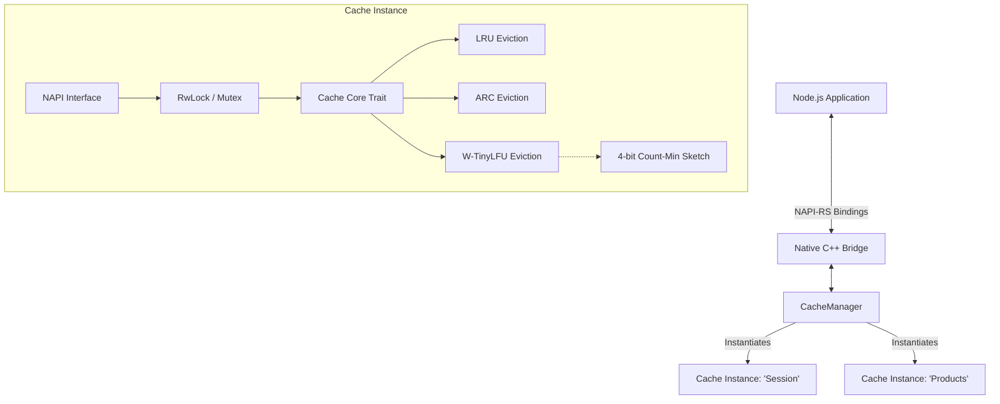

# OffHeap

[](LICENSE-MIT)
[](LICENSE-APACHE)

**OffHeap** is a high-performance, in-process, off-heap caching framework for Node.js written from scratch in **Rust** using **NAPI-RS**. It is designed to bypass the V8 heap and garbage collection (GC) overhead by storing serialized cache values directly in the Rust memory space, while maintaining native speed.

The framework supports multiple isolated cache instances instantiated from a central manager, allowing different parts of your application to have their own cache namespaces, capacities, and eviction policies.

---

## 📚 Academic Foundations & Architecture

To ensure high performance and transparent hit-rate optimization under varying workloads, **OffHeap is written entirely from scratch** based on established public academic caching research.

### Eviction Policies

1. **Least Recently Used (LRU)**
   - The classic baseline policy implemented using an index-based doubly linked list and a hash map for $O(1)$ operations.

2. **Adaptive Replacement Cache (ARC)**
   - *Paper: "ARC: A Self-Tuning, Low Overhead Replacement Cache" (Nimrod Megiddo & Dharmendra S. Modha, USENIX FAST '03)*
   - Dynamically tunes the cache allocation between recency ($T_1$) and frequency ($T_2$) by tracking recent evictions in ghost/history lists ($B_1$ and $B_2$).
   - Completely self-tuning, adapting its behaviour in real-time to match the current workload's characteristics.

3. **Window TinyLFU (W-TinyLFU)**
   - *Paper: "TinyLFU: A Highly Efficient Cache Admission Policy" (Gil Einziger, Roy Friedman, and Ben Manaster, IEEE Transactions on Knowledge and Data Engineering '17)*
   - Utilizes a **4-bit Count-Min Sketch** frequency sketch (with a decay/reset aging policy) to estimate frequency statistics.
   - Combines a small **Window LRU** (capturing bursty recency) and a **Segmented LRU Main Cache** (divided into Probationary and Protected regions) to provide near-optimal hit ratios.
   - When an item is evicted from the Window Cache, TinyLFU decides whether to admit it into the Main Cache by comparing its frequency to the frequency of the Main Cache's probationary victim.

### Architecture Overview



---

## ⚡ Performance Features

- **Off-heap Storage**: Stored outside the V8 heap as raw Rust allocations (`Vec<u8>`). This reduces V8 memory pressure and prevents garbage collection sweeps from scanning cached items.
- **Dynamic Serialization**: Automatically detects and handles data types:
  - **Node.js Buffers / Uint8Arrays**: Direct binary copying (extremely fast, zero V8 object overhead).
  - **Strings**: Stored as UTF-8 bytes.
  - **Objects & Arrays**: Serialized to JSON strings in Rust and parsed back to JS objects upon retrieval.
- **Time-to-Live (TTL)**: Precise expiration support checked lazily on access or deletion.
- **Concurrency**: Fully thread-safe operations guarded by high-performance `parking_lot` locks in Rust, making it safe for multithreaded Node.js Worker environments.

---

## 🚀 Installation & Build

### Prerequisites
- **Node.js** (version 18 or higher)
- **Rust Toolchain** (installed via [rustup](https://rustup.rs/))
- **C++ Build Tools** (MSVC compiler / Build Tools for Visual Studio with C++ workload on Windows; GCC/Clang on Unix)

### Build Native Addon
Install Node dependencies and build the binary:
```bash
npm install
npm run build
```
This command compiles the Rust codebase in release mode and automatically generates the binding loaders (`index.js`) and TypeScript declarations (`index.d.ts`).

---

## 💻 Usage

```javascript
const { CacheManager } = require('./index.js');

// 1. Initialize the Central Manager
const manager = new CacheManager();

// 2. Create isolated caches with different policies and capacities
const sessionCache = manager.createCache('sessions', {
  policy: 'lru',
  capacity: 10000
});

const productCache = manager.createCache('products', {
  policy: 'tinylfu', // Window TinyLFU
  capacity: 50000
});

// 3. Store and Retrieve Values (Type Preservation)
// A. Store Buffers (Zero JSON overhead)
productCache.set('prod_101', Buffer.from([255, 128, 64]));
const rawBuf = productCache.get('prod_101'); // returns Buffer

// B. Store Strings
productCache.set('prod_name', 'Super Widget');
const name = productCache.get('prod_name'); // returns "Super Widget"

// C. Store JSON objects
productCache.set('prod_metadata', { id: 101, category: 'gadgets', price: 99.99 });
const meta = productCache.get('prod_metadata'); // returns JavaScript Object

// 4. Store values with TTL (Expiration)
sessionCache.set('session_abc123', { userId: 42 }, 60000); // Expires in 60 seconds (60000 ms)

// 5. Query stats
console.log(productCache.stats());
// Prints: { hits: 12, misses: 2, capacity: 50000, size: 3 }

// 6. Delete or clear
productCache.delete('prod_101');
productCache.clear();
```

---

## 📊 Benchmarking & Verification

All benchmarks and testing suites are open and reproducible.

### Run Unit Tests
```bash
# Runs Rust-level unit tests
cargo test

# Runs Node.js integration tests
npm test
```

### Run Benchmarks
To compare the throughput of the LRU, ARC, and W-TinyLFU implementations:
```bash
# Rust-level benchmarks (using Criterion)
cargo bench

# JS-level benchmarks (using Tinybench)
npm run benchmark
```

---

## 📄 License

This project is double licensed under:
- **MIT License** ([LICENSE-MIT](LICENSE-MIT))
- **Apache License, Version 2.0** ([LICENSE-APACHE](LICENSE-APACHE))

You may select either license depending on your project's compliance requirements.
